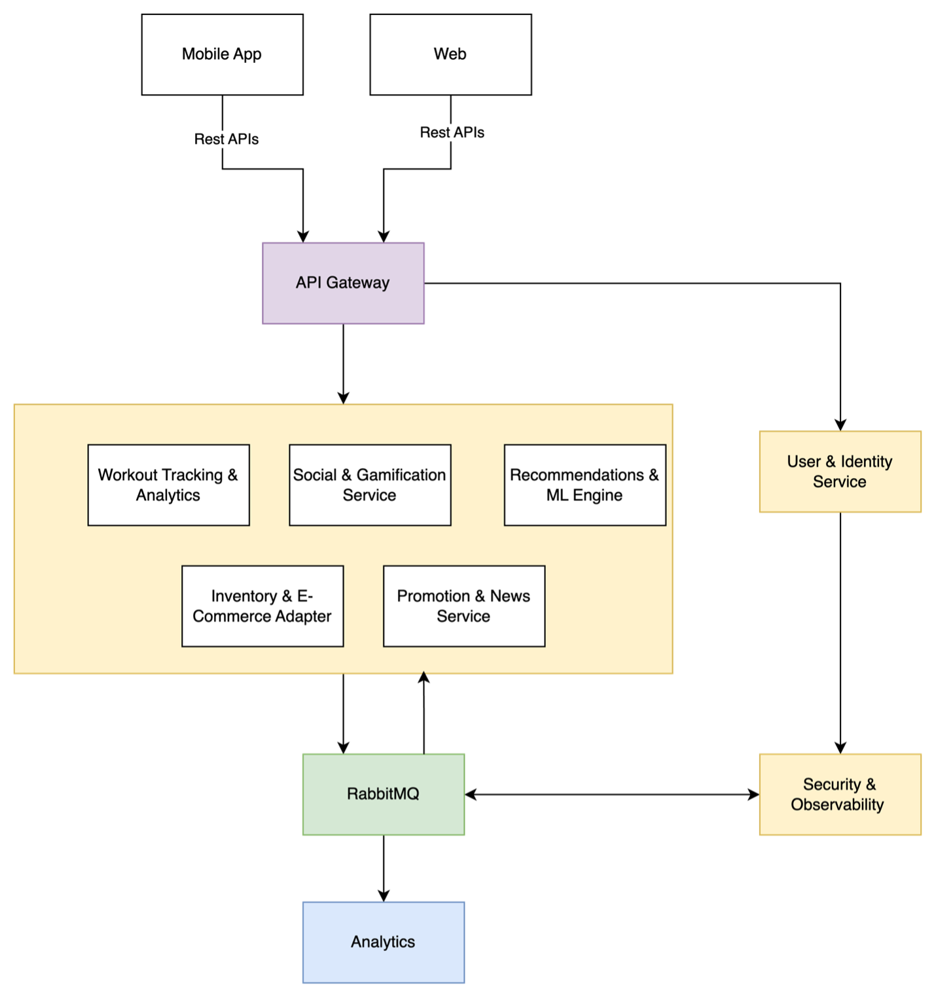

# 04. Разработка концептуальной архитектуры

## 1. Общий обзор архитектурного решения

### 1.1. Архитектурный стиль

1. **Микросервисная архитектура**  
   - Позволяет независимое масштабирование отдельных сервисов.

2. **Контейнеризация и оркестрация**  
   - Использование Docker для упаковки сервисов и Kubernetes для управления ими, что упрощает развертывание в различных облаках.

3. **Централизованный сбор данных**  
   - Логи, метрики и события собираются централизованно для последующего анализа.

**Обоснование:**  
- Масштабируемость критична для поддержки глобальных соревнований и многотысячных сообществ.  
- Удобство внедрения новых модулей (например, дополнительных аналитических сервисов) и экспериментирования с функциональностью.

## 2. Высокоуровневая диаграмма (логическая)

### 2.1. Ключевые компоненты и их роль

1. **Клиентские приложения (Mobile, Web)**  
   - Предоставление удобного интерфейса для конечных пользователей (профиль, лента, чат, геймификация, аналитика).  
   - Для iOS/Android — поддержка нативных фитнес-функций и датчиков; для Web — доступ из браузера с упрощённой функциональностью или админ-интерфейсами.

2. **API Gateway**  
   - Единая точка входа в систему; маршрутизация запросов к нужным сервисам.  
   - Скрытие сложности микросервисов от клиентов, централизованная обработка аутентификации и кеширования.

3. **User & Identity Service**  
   - Управление учетными записями, аутентификацией и авторизацией (OAuth2, SSO).  
   - Безопасное хранение данных пользователей и профилей; единая точка входа для всех приложений компании (интеграция с e-commerce и другими системами).

4. **Social & Gamification Service**  
   - Управление лентой активности, группами/сообществами, лайками, комментариями, рейтингами, очками, бейджами, лидербордами.  
   - Поддержка челленджей и соревнований (массовых и в небольших группах).

5. **Workout Tracking & Analytics**  
   - Сбор и хранение данных тренировок, интеграция с внешними устройствами (пульсометры, фитнес-браслеты).  
   - Измерения (время, дистанция, пульс и т.д.) для сравнения результатов и предоставления рекомендаций.

6. **Recommendations & ML Engine**  
   - Генерация персональных планов тренировок, рекомендаций по инвентарю, оценка риска травм, анализ поведения пользователей.  
   - Персонализированные советы и товарные предложения для повышения конверсии и удержания.

7. **Promotion & News Service**  
   - Управление промоакциями, рассылками новостей, push-уведомлениями о скидках и спортивных событиях.  
   - Прямая реализация цели по росту продаж и повышению узнаваемости.

8. **Inventory & E-Commerce Adapter**  
   - Интеграция с существующим интернет-магазином и системой управления товарами.  
   - Отображение актуальных товаров/цен, добавление в корзину, оформление покупок, сопровождение жизненного цикла инвентаря (например, учет пробега кроссовок).

9. **Broker**  
   - Асинхронный обмен сообщениями между сервисами (например, через RabbitMQ).  
   - Улучшение масштабируемости и возможность быстрого реагирования на события (новая тренировка, завершение челленджа), а также обновление лидеров и расчет наград.

10. **Analytics**  
    - Долговременное хранение и анализ больших объемов данных для BI/ML.  
    - Поддержка построения сложных моделей для прогнозирования поведения пользователей и корректировки промо-стратегий.

11. **Security & Monitoring Services**  
    - Реализация аспектов безопасности (шифрование, управление инцидентами) и наблюдаемости (логирование, сбор метрик).  
    - Критически важны для защиты данных и обеспечения SLA по доступности.

## 3. Основные потоки данных

1. **Регистрация и онбординг**  
   - Пользователь скачивает мобильное приложение или заходит через веб.  
   - Взаимодействие происходит через:  
     `[API Gateway → User & Identity Service]`  
   - После успешного создания учетной записи происходит первичная настройка профиля (выбор видов спорта, целей и т.д.).

2. **Запись тренировок и получение статистики**  
   - Пользователь запускает тренировку в мобильном приложении или подключает устройство.  
   - `[Workout Tracking & Analytics]` получает данные (темп, дистанция, пульс) через API Gateway или напрямую.  
   - Данные транслируются в `[Recommendations & ML Engine]` и `[Social & Gamification Service]` для обновления очков и достижения новых уровней.  
   - Результаты сохраняются в базе, и пользователь видит обновленную аналитику.

3. **Социальное взаимодействие**  
   - Пользователь публикует пост о тренировке, который обрабатывается `[Social & Gamification Service]`.  
   - Другие пользователи комментируют и лайкают, что генерирует события в шине (Message Bus) для обновления статистики и баллов.  
   - Уведомления рассылаются через `[Promotion & News Service]` или push-уведомления.

4. **Покупка спортивного инвентаря**  
   - Пользователь получает рекомендацию (например, «Пора обновить кроссовки») или видит специальную акцию.  
   - `[Inventory & E-Commerce Adapter]` взаимодействует с e-commerce системой, формируя транзакцию.  
   - После завершения покупки данные о товаре добавляются в профиль пользователя.

5. **Участие в челленджах и массовых мероприятиях**  
   - Администратор или партнер создает новое событие (забег, онлайн-челлендж).  
   - Информация хранится в `[Social & Gamification Service]` и рассылается пользователям через `[Promotion & News Service]`.  
   - При высоких нагрузках (тысячи участников) сервисы автоматически масштабируются в Kubernetes.

## 4. Принципы развертывания и мультирегиональность

1. Каждая крупная географическая зона (например, Северная Америка, Европа, Азия) может использовать наиболее подходящего облачного провайдера.

2. **Контейнеризация:**  
   - Все сервисы упакованы в Docker-контейнеры и управляются через Kubernetes (или эквивалент).

3. **CI/CD:**  
   - Автоматические пайплайны для сборки, тестирования и релиза.

---

## 5. Соответствие бизнес-целям

- **Повышение узнаваемости бренда (БТ1):**  
  - Благодаря `[Social & Gamification Service]`, массовым челленджам и легкости шаринга результатов в соцсетях.

- **Рост продаж (БТ2):**  
  - Комбинация `[Inventory & E-Commerce Adapter]` и `[Promotion & News Service]` обеспечивает персонализированные промоакции и прямую интеграцию с магазином.

- **Повышение удержания (БТ3):**  
  - Геймификация, регулярные подсказки по тренировкам и социальное взаимодействие внутри экосистемы способствуют удержанию пользователей.

- **Масштабирование экосистемы (БТ4):**  
  - Микросервисный подход и мультирегиональные развертывания позволяют расширять аудиторию.

- **Инновации и данные (БТ5):**  
  - Использование `[Recommendations & ML Engine]` и `[Analytics]` для глубокой персонализации, прогнозов и экспериментов.

## 6. Ключевые преимущества предложенной концепции

1. **Гибкость и масштабируемость:**  
   - Микросервисы, контейнеризация и облачная инфраструктура позволяют выдерживать пиковые нагрузки при массовых мероприятиях.

2. **Быстрая эволюция:**  
   - Возможность добавлять новые сервисы (например, для специфичных видов спорта) без кардинальных изменений архитектуры.

3. **Реализация сложной функциональности:**  
   - Четкое разделение сервисов и использование брокера для интеграции обеспечивает поддержку геймификации, аналитики и интеграции с устройствами.

4. **Безопасность и соответствие требованиям:**  
   - Централизованная аутентификация, шифрование, управление доступом и соблюдение локальных законов по хранению данных гарантируют высокий уровень безопасности.
