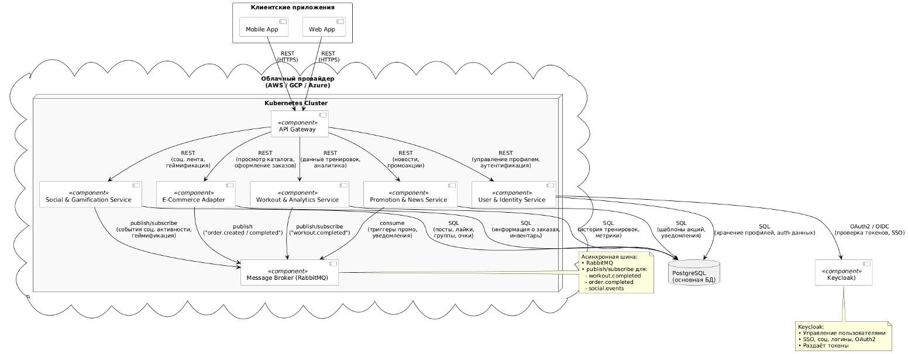

# 13. Базовая архитектура с учётом бизнес-требований, НФТ и выбранной архитектуры

Ниже приведён пример UML-диаграммы в формате, которая показывает ключевые микросервисы, их взаимосвязи, а также взаимодействия. На схеме обобщены принятые архитектурные решения (из предыдущих документов) и показаны, как они отвечают конкретным ограничениям (со стороны бизнес-задач, технических условий) и ключевым атрибутам качества (масштабируемость, надежность, безопасность)

