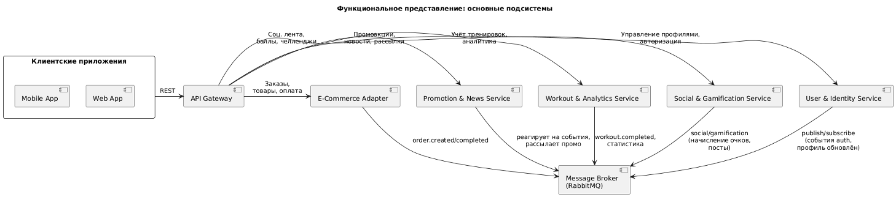
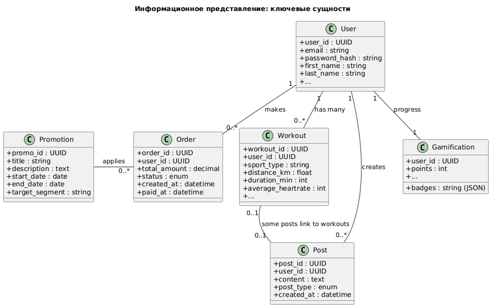
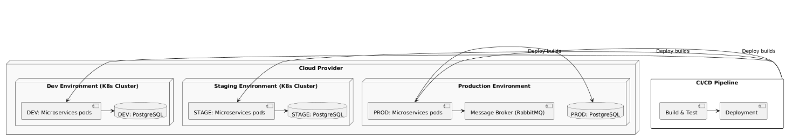
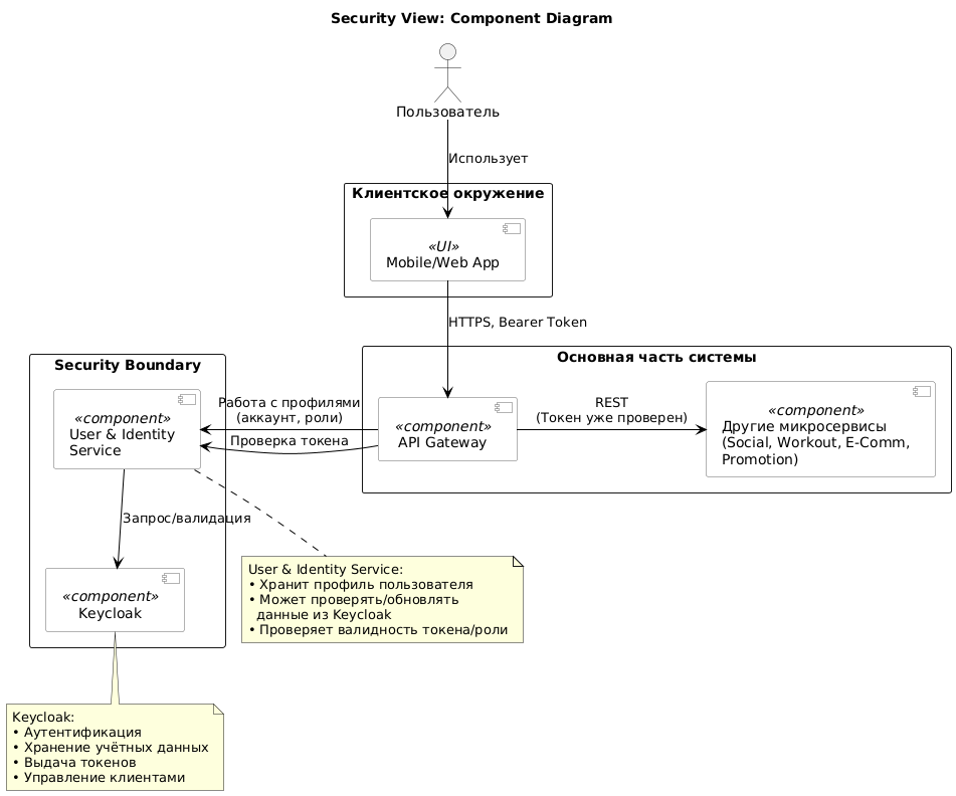

# Функциональное представление

- Какие основные подсистемы есть, за что они отвечают и как взаимодействуют

# Информационное представление

- Каковы ключевые сущности данных, где они хранятся, как перемещаются между сервисами

# Многозадачность (Concurrency)

- Как обрабатываются параллельные запросы, что происходит при пиковых нагрузках, как организована асинхронная обработка.

# Инфраструктурное представление

- Каким образом развёртывается система, какие среды есть, как используется Kubernetes, облака, CI/CD

# Безопасность

- Как осуществляется аутентификация и авторизация, шифрование, защита данных, соответствие требованиям

